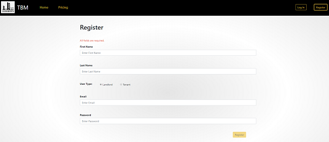
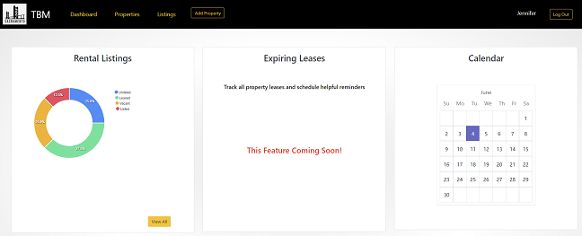
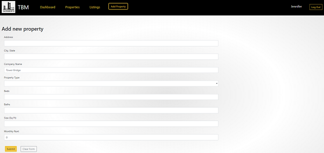
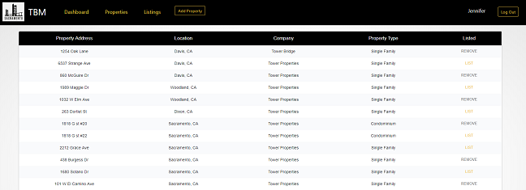
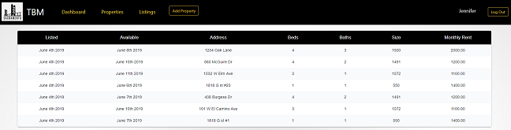

# Project 3: TBM (Tower Bridge Management)

[Presentation link](https://docs.google.com/presentation/d/1PG7spOOYYOieRSUBN8rZRoCd3GZ1ADEuJc6U4SrMrm0/edit?usp=sharing)

[TBM application link](https://polar-springs-68613.herokuapp.com/)

---

## Description

This application was written for project 3 of the UCD Coding Bootcamp. The front end was built using React, Material-UI, and CSS/CSS Bootstrap. The backend uses Sequelize and Mysql database.

It was designed as a management tool for owners to track their properties. The landing page provides users with the opportunity to learn about the application's features. Once registered/logged in, the user is directed to their dashboard where they have an overview of their rental listings, upcoming expiring leases (feature coming soon), and a calendar.

Users may also do the following via the navbar:

- Add Property button - Add rental properties to their porfolio
- Properties link - View all properties in their portfolio & add them to the Listings page
- Listings Link - View the dates each property was listed for rent and when it became available for occupany as well as property details

---

## Technology

- Axios
- Bcrypt
- CSS
- CSS Bootstrap
- Express
- Font Awesome
- HTML
- JSON Web Token
- JavaScript
- Material-UI
- Moment.js
- Mysql2
- React
- React-Apex Chart
- Sequelize

---

## Authors and acknowledgment

- Jennifer Jones
- Muhammad Tahir
- Razina Ali

---

## Sample Views

### Home Page - Navbar

---

### Home Page - Overview & Footer

---

### Pricing Page

---

### Registration Form

---

### Dashboard Page

---

### Add New Property Form

---

### Properties Page

---

### Listings Page

