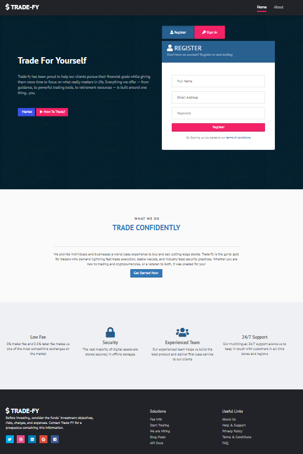
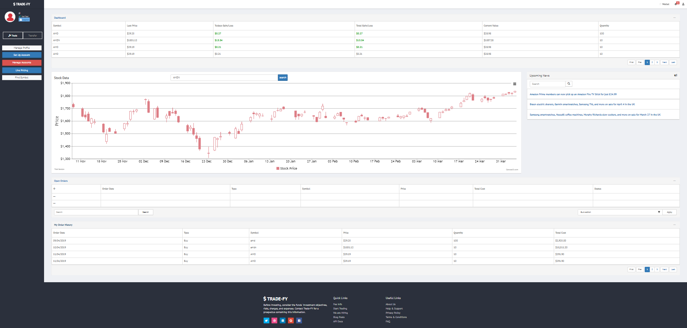

# Project 2: $ TRADE-FY (Trade For Yourself)

[Trade-FY presentation link](https://1drv.ms/p/s!Ai2IBICnEzkUiRRIhuN6CJIehdAF)

[Trade-FY application link](https://floating-headland-19856.herokuapp.com/)

## Description
This application was written for project 2 of the UCD Coding Bootcamp. The landing page provides users with the opportunity to learn about trading as well as register to create a secure sign in. Once signed in, the user may set up a link to their bank account, transfer funds from the bank account to Trade-FY, and buy/sell stocks or mutual funds. 

## Technology
* AJAX
* API - News
* CanvasJS-chart
* CSS
* CSS Bootstrap
* Dotenv
* Express
* Font Awesome
* HTML
* JavaScript
* jQuery
* Moment.js
* Mysql2
* Passport.js (with bcrypt-nodejs)
* Sequelize

## Authors and acknowledgment
* Mallika Chakraborty
* Jennifer Jones
* Muhammad Tahir 
* Sohail Zafar

## Sample Views

***
### Introduction & Registration 

***
### Dashboard & Trading

