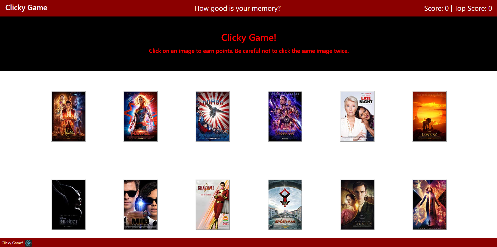

# clicky-game

## Description

This memory game challenges the user to click on unique images while the game shuffles them into a new configuration after each click. The user's score and topscore (i.e., most number of unique images clicked) is tracked in the upper right corner. Game ends when user clicks on all 12 unique images or clicks on the same image twice.

---

## Live Demo

This application is deployed to [Heroku](https://morning-beach-93852.herokuapp.com/)

---

## Sample View

---

## Technologies Used

- HTML
- CSS Bootstrap
- CSS
- ES6
- JavaScript
- React
